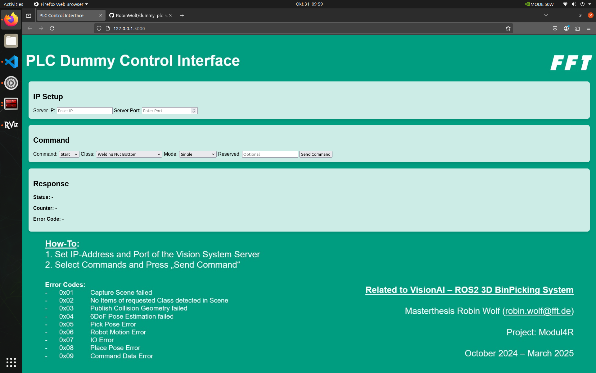

## Start the Dummy-PLC Server:
- get the sourcecode from [GitHub](https://github.com/RobinWolf/dummy_plc_webapp) or [Gitea]()
- open a new Terminal
- cd to the *dummy_plc* directory
- **for the first use only** build the container image with ```./build.sh```
- start the container from built or cached image with ```./run.sh```
- open the webserver with the link shown in your Terminal
- setup the IP and Port with the Server Configuration (see above)
- select a command and press *Send Command*


